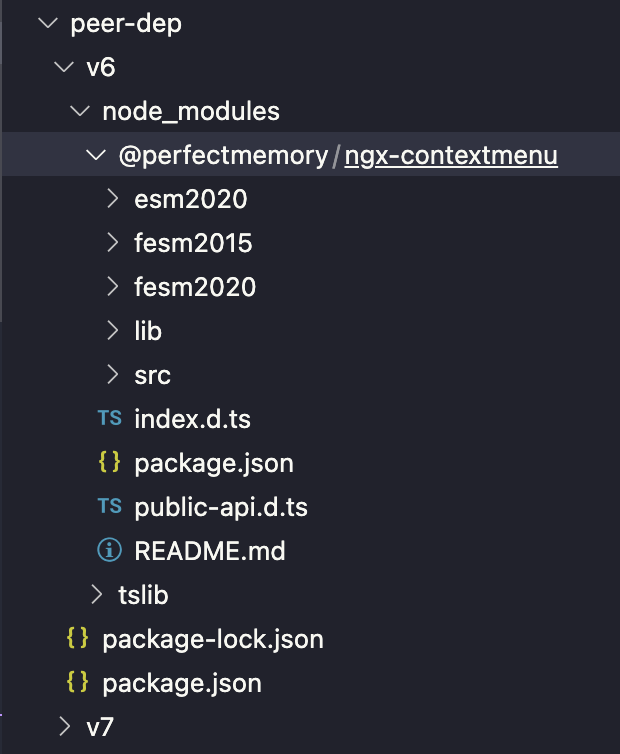
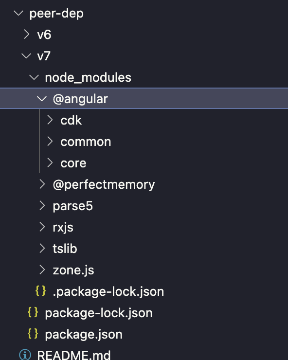
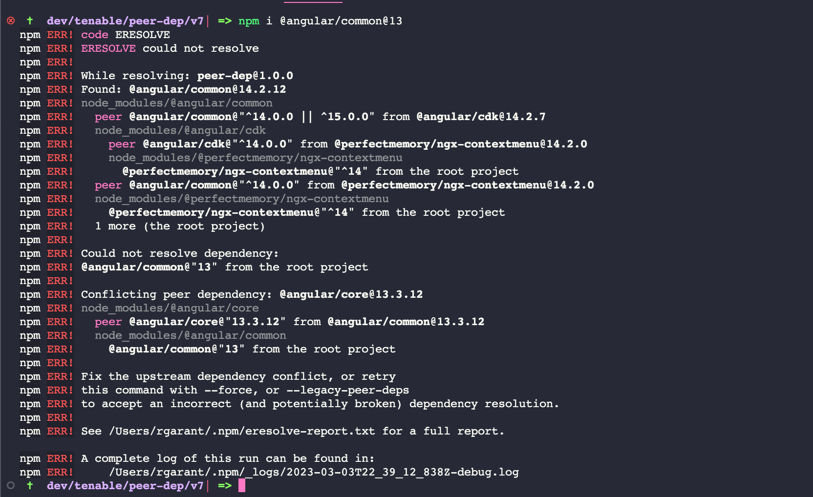

# Peer Dependences NPM v6 vs v7

> Basic difference is npm v6

## Example

- In folder v6 & v7 is installed one package: `@perfectmemory/ngx-contextmenu`
- It has these peer deps listed in it's package.json:

```
  "peerDependencies": {
    "@angular/cdk": "^14.0.0",
    "@angular/common": "^14.0.0",
    "@angular/core": "^14.0.0"
  },
```

## NPM v6

- Switch to npm v6

```
npm i npm@6 -g
npm -v # 6.x.x
cd v6
npm install
```

Notice peer deps are not auto installed:



Observe that npm installs with these warnings but does not fail:

```
npm notice created a lockfile as package-lock.json. You should commit this file.
npm WARN @perfectmemory/ngx-contextmenu@14.2.0 requires a peer of @angular/cdk@^14.0.0 but none is installed. You must install peer dependencies yourself.
npm WARN @perfectmemory/ngx-contextmenu@14.2.0 requires a peer of @angular/common@^14.0.0 but none is installed. You must install peer dependencies yourself.
npm WARN @perfectmemory/ngx-contextmenu@14.2.0 requires a peer of @angular/core@^14.0.0 but none is installed. You must install peer dependencies yourself.
npm WARN peer-dep@1.0.0 No description
npm WARN peer-dep@1.0.0 No repository field.

added 2 packages from 3 contributors in 0.645s
```

## NPM v7

- Switch to npm v7

```
cd v7
npm i npm@7 -g
npm -v # 7.x.x
npm install
```

Observe no warnings and that peer deps are auto installed for you:



```
npm i @angular/common@13
```

Observe npm v7 fails npm install and does not install @angular/common v13.x:



To get around this new peer dep error, that's where the `overrides` solution comes in with npm v8.

```
cd v8
npm i npm@8 -g
npm -v # 8.x.x
npm i @angular/common@13
```

Notice we already have the overrides listed in the v8/package.json but we still get the peer dep errors.

That is because overrides require you to manually install a dependency if it is listed as an override.

```
npm i @angular/common@13 @angular/core@13 @angular/cdk@13
```

Notice, npm finally succeeds to install. If you inspect `./v8/node_modules/@angular/common/package.json`, it's version is 13.x. Additionally if you navigate to `./v8/node_modules/@perfectmemory/ngx-contextmenu` notice there is no @angular/common@14 module because we overrode it.

> This is just a temporary workaround to fix a peer dep error. The best solution is the upgrade either your dependency, or the peer dependency that is being requested.